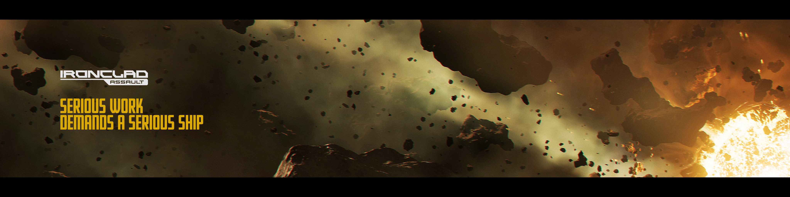
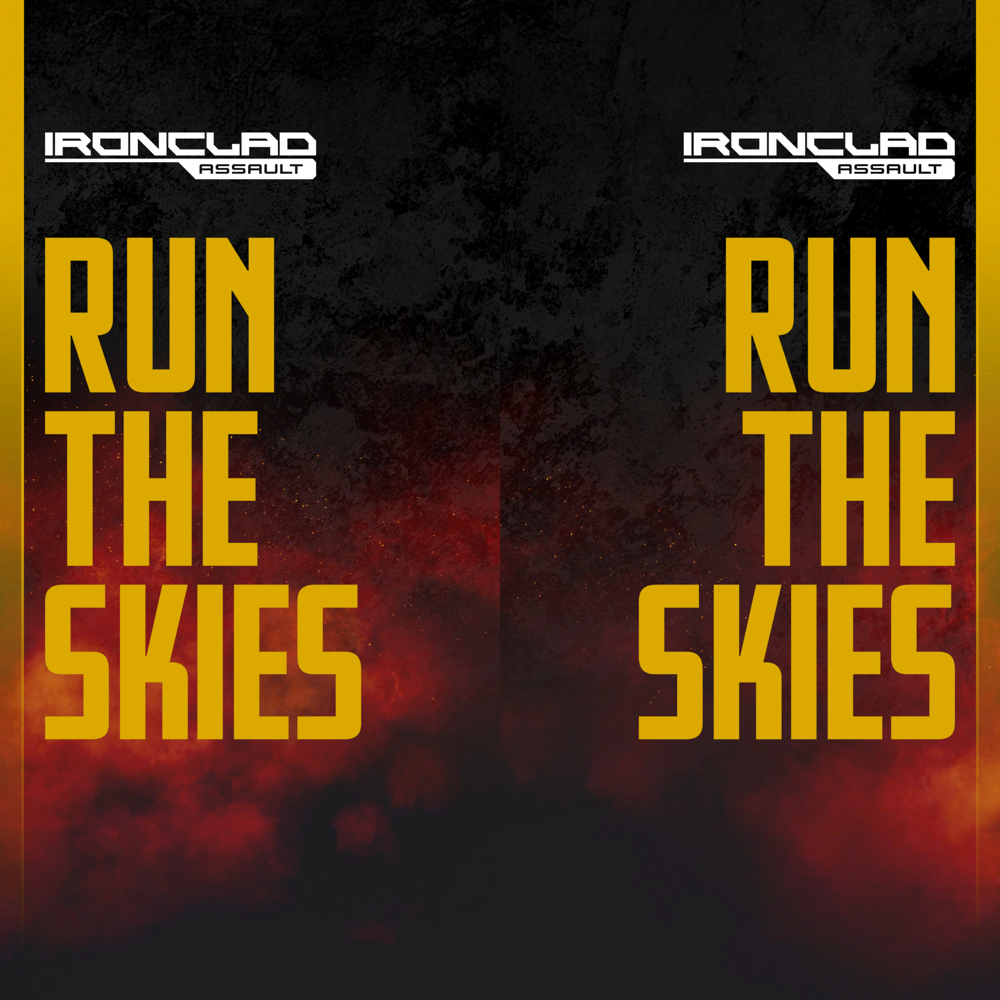

[**Back to the main post**](../README.md)

# Media

## Images

### Grey's Basher Teaser

### Drake DefenseCon Ironclad Branding

## Video

### Drake Manufacturer Showcase
<video controls src="../media/videos/trailer_drake_dwv_01.mp4" title="Title"></video>

## Audio

### Drake DefenseCon Hall Lines

> "If you're stuck in the past, then you might as well be dead. The future is for those bold enough to take it, and for these DefenseCon new standards."
 
<video src="../media/audio/stuck_in_the_past.mp3" controls></video>
 
> "Sure, some people like ships, but if you live and breathe thruster exhaust, then you know just what makes these spacecraft your DefenseCon pilots' choice."
 
<video src="../media/audio/thruster_exhaust.mp3" controls></video>
 
> "Drake Interplanetary. Blasting scum since 2845."
 
<video src="../media/audio/blasting_scum.mp3" controls></video>
 
> "Ready to be your own captain? Fly free, fly Drake."
 
<video src="../media/audio/fly_free_fly_drake.mp3" controls></video>
 
> "When you're tired of the rest, check out the best in the Drake Interplanetary main hall."
 
<video src="../media/audio/check_out_the_best.mp3" controls></video>
 
> "Sleek hulls and fancy finishes might turn heads, but Drake knows that war isn't a beauty contest."
 
<video src="../media/audio/war_isnt_a_beauty_contest.mp3" controls></video>
 
> "Remember, DefenseCon is a stim-free event. So don't get caught."
 
<video src="../media/audio/stim_free_event.mp3" controls></video>
 
> "From the biggest battles to your very own backyard. Drake Interplanetary makes these spaceships that people want to fly."
 
<video src="../media/audio/people_want_to_fly.mp3" controls></video>
 
> "You know the lines of their hull, the feel of their flight stick tight in your fist. These are your DefenseCon frontline favorites."
 
<video src="../media/audio/frontline_favorites.mp3" controls></video>
 
> "The Vanduul are at humanity's door. How will you be remembered? Do your part. Defend Nix, save the Empire."
 
<video src="../media/audio/defend_nix_save_empire.mp3" controls></video>
 
> "Remember that all opinions expressed by Drake Interplanetary and DefenseCon representatives are just for entertainment purposes. So let's have some F-U-N fun."
 
<video src="../media/audio/entertainment_purposes.mp3" controls></video>
 
> "Some like to go it alone, but for those of you who load out with the full do-or-die squad of trusted wingmen, then these DefenseCon steady support are for you."
 
<video src="../media/audio/steady_support.mp3" controls></video>
 
> "DefenseCon is proudly brought to you by Drake Interplanetary and the smooth taste of Smugz, the beer of choice for pilots everywhere."
 
<video src="../media/audio/smooth_taste_of_smugz.mp3" controls></video>
 
> "From the classics you love to the unexpected, there's something for every hero, every day at DefenseCon 2956."
 
<video src="../media/audio/something_for_every_hero.mp3" controls></video>
 
> "Forget doing your duty. We here at DefenseCon believe in doing what's right. Not because you have to, but because a true warrior fights for what they believe in every loving day."
 
<video src="../media/audio/doing_whats_right.mp3" controls></video>
 
> "Serious work demands a serious ship. It's your turn to run the skies with the powerfully designed Drake Ironclad."
 
<video src="../media/audio/drake_ironclad.mp3" controls></video>
 
> "Know your foe. Outlaws are everywhere, and you're the Empire's last line of defense. When the time comes, be ready to stand your ground and give no quarter."
 
<video src="../media/audio/know_your_foe.mp3" controls></video>
 
> "Whether you're a fan of Anvil, Origin, Aegis, or MISC, there's a Drake ship just right for you in the main hall."
 
<video src="../media/audio/drake_ship_right_for_you.mp3" controls></video>
 
> "DefenseCon's got more than just incredible ships and vehicles. There's upgrades, weapons, armor, and more. This is your chance to get the goods and be the best."
 
<video src="../media/audio/get_the_goods.mp3" controls></video>
 
> "Hey, don't let the party stop. Exclusive DefenseCon merch means that you can keep the excitement and thrills of the universe's best ship show going all year round. Get yours before it's too late."
 
<video src="../media/audio/exclusive_merch.mp3" controls></video>
 
> "Who says defending the Empire has to be boring? From badass guns to killer ships, DefenseCon's got everything to make your next flight less 'oh no' and a lot more 'hell yeah!'"
 
<video src="../media/audio/hell_yeah.mp3" controls></video>
 
> "Visit DefenseCon with the might of Anvil Aerospace's next generation battle cruiser, the Odin. Get ready for the heavens to shake with a unique holographic experience, only at the IO North rooftop."
 
<video src="../media/audio/anvil_odin_hologram.mp3" controls></video>
 
> "While this year's party is only getting started, it's never too early to get a glimpse at what's ahead. Mark your calendars now. At DefenseCon 2957, Drake will unleash the Kraken."
 
<video src="../media/audio/unleash_the_kraken.mp3" controls></video>
 
> "Get ready. Drake Interplanetary and a few other ship manufacturers are throwing the verse's biggest party to celebrate you, the everyday heroes. Don't miss your chance to get up close and personal with fighters, freighters, gunships, and all your frontline favorites. I'm Drake CEO Anton Arten, and I'll see you at the Bevic Convention Center for DefenseCon 56."
 
<video src="../media/audio/anton_arten_invite.mp3" controls></video>
 
> "I'm Drake Interplanetary CEO Anton Arten. Welcome to Drake's DefenseCon, the verse's biggest celebration of you, the true defenders of this great Empire. In these halls, you'll find vehicles ranging from the revered classics to the latest never-before-seen models, and maybe even the next addition to your hangar. But most importantly, you're gonna have a hell of a great time. So step inside, and let's get this party started!"
 
<video src="../media/audio/anton_arten_welcome.mp3" controls></video>
