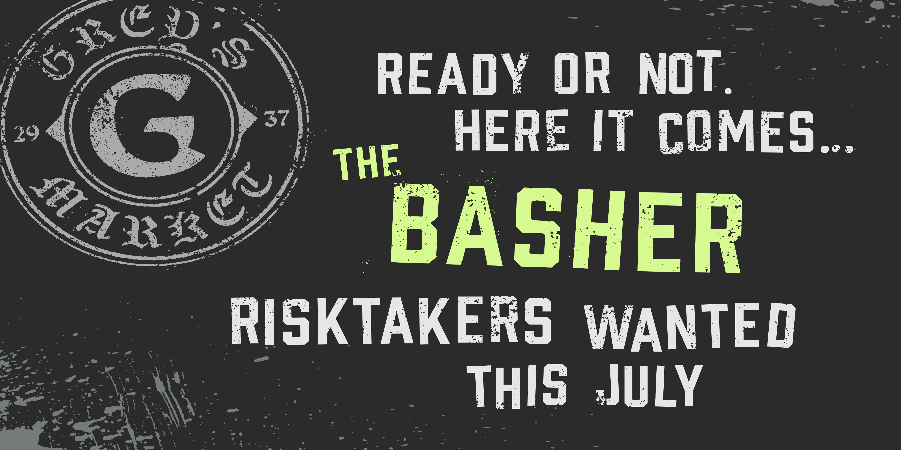
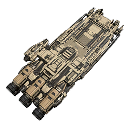
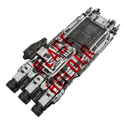
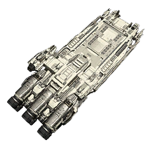
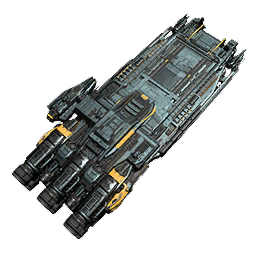
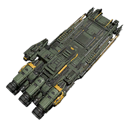
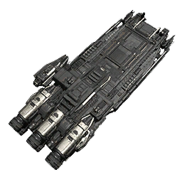

[**Back to the main post**](../readme.md)

# Vehicles & Ships

## Ships

### Drake Ironclad Series

*Both the Ironclad and the Ironclad Assault have been added to the game, accessible to backers with ownership of one.*

### Grey's Basher Teaser

*While no further info is known other than it's release in July, going by the naming correlation between the Cutlass and the Shiv, the Basher might be a modded Mustang.*

## Paints

### Ironclad Sediment Livery

> When the job takes you to the back end of nowhere and back again, there's the Sediment livery which coats the Ironclad in a robust shade of brown.

### Ironclad Dauntless Livery

> Make the Ironclad even more imposing and impressive with the Dauntless livery, which is primarily black with striking silver highlight.

### Ironclad Wind Chill Livery

> The Wind Chill livery for the Ironclad features crisp white paint with black highlights and silver accents.

### Ironclad Aquamarine Livery

> The Aquamarine livery for the Ironclad gives a metallic teal base with subtle yellow accents to make a statement, before you throw a punch.

### Ironclad Commando Livery

> Primarily green with yellow accents, the Commando livery allows the Ironclad to blend in with forests and verdant locations. 

### Ironclad Black Silver Black Livery

*Name or use is not known*

